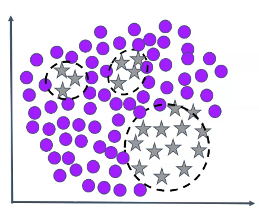

## Overview

Imbalanced classes may not be a problem if the data is big enough or if the classes are linearly separable

**Within-class imbalance**: In some classification problems, a class contains many subclasses; the class is not homogeneous and some subclasses are imbalanced between each others.

