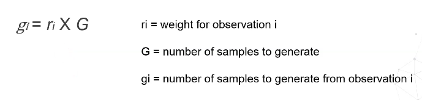
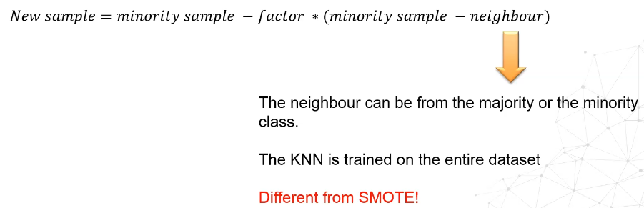

## Overview

**Factors** that influence the ability of a classifier to identify rare events are:

- Small sample size: Imbalanced classes may not be a problem if the data is big enough
- Class separability: if the classes are linearly separable for e.g, this is not a hard problem
- Within-class imbalance: In some classification problems, a class contains many subclasses; the class is not homogeneous and some subclasses are imbalanced between each others.

Three **approaches** are usually used to tackle imbalanced data: Data approaches, cost-sensitive approaches and ensembling.

## Metrics

## Undersampling

The **Balancing ratio** is the ratio of the minority class to the majority class. 	

There are two families of methods:

- **Fixed**: reduce the majority class to the same # of observations as the minority class
- **Cleaning**: Clean the majority class based on some criteria

### Random undersampling

This is a naïve technique that undersamples the majority class till reaching the balancing ratio that we want. Some problems with this method

- Some majority classes classes might be hard to learn
- The # of samples in a minority class might be very limited and reaching a certain balancing ratio would eliminate so much information about the majority class

### Condensed Nearest Neighbours

This is a cleaning method that extracts observations from the majority class(es) at the boundary between 2 or more classes. The final dataset shape varies and boundary(ies) matters.

To understand this method, please refer to this video: https://youtu.be/H7f_J4HjlWE. The difference with the video is that the starting set of points S consists of the points in the minority class + 1 point from the majority class. The final version of S is the undersampled dataset.

### Tomek links

2 samples have a Tomek Link if they are nearest neighbours and are from a different class. This undersampling method removes Tomek links by removing the datapoint from the majority class - this behavior can be tweaked to remove the corresponding point the minority class as well-. The final dataset distribution will change. The assumption of this technique is that boundary points are noise.

### One-sided selection

This is considered an improvement on both CNN and Tomek's link. It's a two-step method. First, apply CNN and then apply Tomek's link. 

CNN selects samples of the majority class that are similar to those of the minority class. Thus, it is prone to introduce some noise. With Tomek links, this procedure aims to remove this "noise".

### Edited Nearest Neighbours

This method uses KNN and if the nearest points have the same label as the class of the observation considered, it is removed from the dataset. This method removes samples that are close to the decision boundary (Those that are too similar to observations of the minority class - opposite of CNN).

### Repeated Edited Nearest Neighbours

Repeat the Edited Nearest Neighbours until no more observations are removed or until a maximum # of cycles is reached. The same number of nearest neighbours is used in each pass over the data.

### All KNN

This algorithm works in the same way as Repeated Edited Nearest Neighbours but adds 1 neighbour to KNN at each pass. This algorithm is more stringent than RENN.

### Neighborhood cleaning rule

First apply *Edited Nearest Neighbours* to remove points from the majority class. Then look at the neighbours of the minority class and if any of the neighbours can cause a misclassification, remove it. In the second step, one could set a threshold that represents (from imbalanced-learn doc):

### NearMiss

This method is a fixed method. The final size of the dataset is 2 * size of minority class. There are 3 versions of it.

- *NearMiss 1*: Retains points in the majority class that are the closest to their neighbours. Usually, it retains points that are far away from the main cluster of the majority class
  - Select the 3 nearest neighbours for each point in the majority class from the minority class
  - Select the points from the majority class with the smallest average distance to the minority neighbours.
- *NearMiss 2*: Retain points in the majority class that are the closest to the farthest points from the minority class. Usually, it keeps points from the majority class that are in the middle with respect to the points of the minority class
  - For each point of the majority class, select the 3 furthest points in the minority class
  - Select the points from the majority class that have the smallest average distance to the corresponding points in the minority class
- *NearMiss 3*: This method removes points from majority class that are very far from the main cluster of points and very close to the decision boundary
  - For each point in the minority class, select the 3 neighbours from the majority class. We then remove all points that are far away from the majority class
  - For each point in the majority class, select the 3 closest neighbours from the minority class, calculate the average distance and select only those whose average distance is the largest.

Here are some alternative definition from [machinelearningmastery](https://machinelearningmastery.com/undersampling-algorithms-for-imbalanced-classification/):

### Instance Hardness Threshold

Train a classifier and remove the points that are very hard to classify in the majority class. A probability threshold is defined to say when the instance is considered as hard to classify.

For a more thorough explanation, please read [this blog](https://towardsdatascience.com/instance-hardness-threshold-an-undersampling-method-to-tackle-imbalanced-classification-problems-6d80f91f0581)

## Oversampling

### Random Oversampling

Duplicate observations at random from the minority class until a certain balancing ratio is reached. This increases the likelihood of overfitting.

### SMOTE

### SMOTE-NC

SMOTE Nominal Continuous extends the SMOTE to categorical variables. From all the algos listed in the oversampling part, only SMOTE-NC and Random Oversampling work with categorical data. The two sources of difficulty are 

- Measuring the distance when having categorical features: the idea is to quantify the difference in categorical variables in a way that it would in the same order of magnitude as the change in numerical variables.
- What categorical value will the simulated sample take: the majority categorical value of the neighbours of the original point

### ADASYN

This method uses a weighted distribution of the minority class and generates more synthetic data from samples that are harder to learn.

ADASYN uses all classes data points to train KNN. The interpolation is done between a sample of the minority class and a neighbour from the minority or the majority class.

The following are the steps of ADASYN:

- Determining the **balancing ratio**: *R = #minority / #majority*

- Determining the # of **samples that need to be generated**: *G = (#majority - #minority) \* some_ factor*

  *factor* is determined by the balancing ratio

- **Train a KNN** using the entire dataset and **determine the weight** for each sample from the minority class

  

- **Normalize r** for each observation of the minority class

  

- Calculate the **# of observations to generate** for **each** observation in the minority class

If an observation of the minority class doesn't have any point from the majority class as its neighbour, its weight *r* is going to be null and it's not going to be used in the data generating process.

- For each *xi* from the minority class, generate *gi* number of samples

  

### Borderline SMOTE

This variant of SMOTE creates synthetic examples only from observations of the minority class that are closer to the boundary with the majority class. This method has two versions to it

The selected observations are called the danger group.

As of this step there two ways to go about it:

- **Variant 1**

- **Variant 2**

### SVM SMOTE

It creates synthetic examples using only observations from the minority class closer to the boundary with the majority class. The boundary is given by the  support vector of SVM.

### Kmeans SMOTE

This method is particularly useful if we have more than 1 cluster in the minority class (within-class problem)

One needs to select a threshold for the % of presence of the minority class in the cluster. We select the clusters whose % of the minority class is  > than the threshold.

To generate the samples, we need to weight the clusters

The sparser the cluster is, the more samples we generate in the cluster

## Over and Under sampling

The best combo is the second row:

## Ensemble methods

### Overview

The way most classifiers are conceived, they focus on improving the accuracy. That's why they are not used alone to tackle imbalanced data problem.

There are many ways to go about it in the literature

### Bagging

**Under-bagging**: We copy the minority class data points and we bootstrap the majority class. Copying the minority dataset as is is not a must.

In the case of decision trees, it yields Balanced Random Forest.

**Over-Bagging**: We bootstrap using both minority and majority class

### Boosting resampling

**Random undersampling boost**

**SMOTE boost**

**RAMO Boost**: equivalent of SMOTE Boost but using an ADASYN based method

### Hybrid methods

Hybrid methods are a mixture of bagging + boosting + data pre-processing. Adaboost is used on each bag. A layer of under/over sampling are used when creating the bags.

An example of such an algorithm is **EasyEnsemble**, where we use Random Under-sampling + Bagging of Adaboost

**BalanceCascade** is another one where we use the same technique as EasyEnsemble but the correctly classified point are removed from the training set at each model creation in Adaboost.

## Cost sensitive learning

The idea is to assign a bigger cost for misclassifications that count the most for the usecase at hand. The questions are:

- What are the types of cost?
- How to obtain the cost (how to design the cost matrix)?

### Determining cost

In cost matrix, C(i,j) represents the cost of assigning an observation of class j to class i. The default cost-matrix assigns the same cost for all errors.

- Low cost (or default cost) will not find the proper classification boundary => biased towards the majority
- High cost might might impair generalization => biased the model towards the minority class

### Conditional risk - Expected cost

This is a way of embedding the cost of misclassification C(i, j) into the prediction P(j|x). The risk is used to determine the new prediction; the lower the risk, the better it is.

### MetaCost

MetaCost is a procedure to make cost-insensitive algorithms cost-sensitive. The idea is to create a new dataset that incorporates the risk by relabelling the dataset so that the labels minimize the risk.

## Probability calibration

A good introductory video to calibration and why it should be done: https://www.youtube.com/watch?v=A1NGGV3Z4m4 . Just watch the whole playlist (4 videos)!

When calibrating a model, one has to pay attention to the # of observations per interval cause it's hard to obtain the real positive fraction if we have few observations. The number of bins in the plot is also a problem, why not use an ECDF!

When one changes the distribution of the classes (by doing some resampling) or changes the loss function, the relationship between the returned probabilities and the fraction of positive observations is distorted. To convey likelihood => calibrate probabilities.

Calibration shouldn't be done using the training set. If the model overfits perfectly to the training set and orders the points perfectly, then the calibration on the training set is going to output a 0/1 function.

