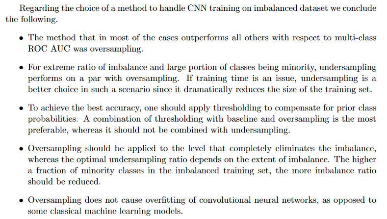

# A tour of imbalanced data methods

## Some history

Over the years, my go-to techniques when dealing with imbalanced classes have been:

- **oversampling the under-represented class**: I used to think that this method would *always* yield overfitting but that's not the case. [**This paper**](https://arxiv.org/pdf/1710.05381.pdf) that I discovered thanks to [fastai courses](https://www.fast.ai/) changed my mind with respect to oversampling. The paper compares different methods of dealing with imbalanced data in the context of CNN. Here are the conclusions of the paper

  

  

- **Tweaking loss functions** or using loss functions that are made for this purpose like **[focal loss](https://www.youtube.com/watch?v=44tlnmmt3h0)** (Yes, I use it even on tabular data and not only in CV)

- **Generate new data using GANs** but this often ended-up with a failure, but who the hell doesn't like playing with GANs!

I have to say that in most day-to-day tasks, I prefer using the first two methods as they are easy to implement and not energy-consuming^_^

To make sure there aren't some handy-dandy techniques that I've missed, I've decided to go through **Soledad Ghali** course on Imbalanced data.

## Readings

- **[Machine Learning from Imbalanced Data Sets 101](./Readings/Machine%20Learning%20from%20Imbalanced%20Data%20Sets%20101.md)**: This short paper tries to give a definition for the problem of imbalanced datasets when it comes to ML models. To do so, the author asks a number of questions and discusses in a very high-level the methods used today. The paper dates back to the year 2000. Yet, the discussion and the arguments remain valid.

## Datasets

Here is the list of the datasets used in this repo:

- **kdd2004.csv**: This file's data comes bundled with imbalance-learn package. The original version was pre-processed before being saved to the csv file.